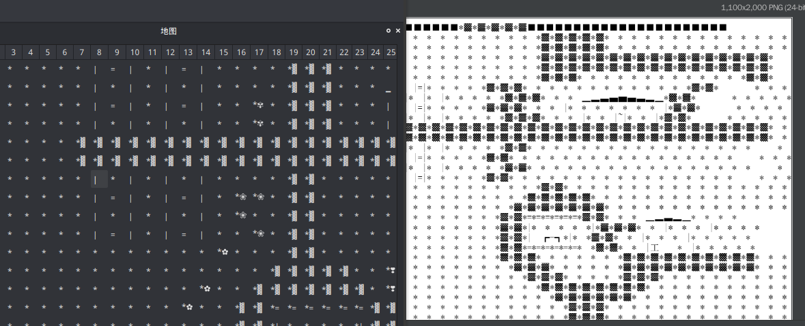
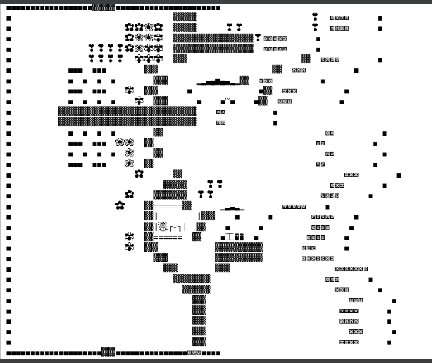

<p align="center">

</p>


# TextWar
### A Simple game for chatting software

This game is based on Unicode character design, 
you can stitch your map by characters, and build your own server and player battle.

This RPG game is designed with NPCs, monsters, creatures, skill points.

And will be designed to interface with all chat software.

This game is based on the java,groovy,python.
#### Matching components

We wrote a game's map generator and map editor using python.

Data structure with json as map.

If you want to make and modify maps, use the [MapEditor](https://github.com/TextWar/Textwar-MapEditor)

You should get the [Map generator](https://github.com/TextWar/textwar-py) to run it.



<p align="center">

</p>


#### Project Structure

- [PHPTextWarClient](https://github.com/TextWar/TextWar-PHP-Client)
- [PythonTextWarMapEditor](https://github.com/TextWar/Textwar-MapEditor)
- [PythonTextWarMapGenerator](https://github.com/TextWar/textwar-py)
- [TextWarPom](textwar_pom)
- [TextWarCore](textwar)
- [TextWarClientConnector](textwar_client_connector)
- [TextWarConsole](textwar_console)
- [TextWarPlugin](textwar_plugin)
- [TextWarProtocol](textwar_protocol)
- [TextWarQQConnector](textwar_qq_connector) This version has stopped the next maintenance

#### Project Dependency

- com.alibaba:fastjson:1.2.47
- org.spockframework:spock-core:0.6-groovy-1.8
- org.codehaus.groovy:groovy-all:2.3.11
- net.sf.py4j:py4j:0.10.9
- org.xerial:sqlite-jdbc:3.30.1
- commons-io:commons-io:2.6
- org.apache.xmlrpc:xmlrpc-client:3.1.3
- org.apache.logging.log4j:log4j-core:2.11.1
- jline:jline:2.14.2
- org.yaml:snakeyaml:1.16
- net.mamoe:mirai-core-qqandroid-jvm:0.30.1
- net.mamoe:mirai-core-jvm:0.30.0
- net.mamoe:mirai-japt:1.1.1
- org.jetbrains:annotations:13.0
- org.jetbrains.kotlin:kotlin-stdlib:1.3.70
- org.jetbrains.kotlinx:kotlinx-coroutines-core:1.3.5

#### Project Tests

- [Tests](tests)

#### API

We will support the api for the TextWar plugins.

such as

```groovy
 GameMap map = new GameMap(EXAMPLE_MAP);
        Player player = new Player(new Vector(0,0),192992929,1,1,1)
                .addInto(map)
                .as(Player.class);
        player.move(new Vector(1,2),map).update();
        Mob mob = new Slime(new Vector(1,1),0)
                .addInto(map)
                .as(Mob.class);
        mob.move(new Vector(3,1),map).update();
```
#### WIKI

You can see more in [wiki](https://github.com/TextWar/QQTextWar/wiki)

#### CopyRight

@CopyRight TextWar Developing Studio


